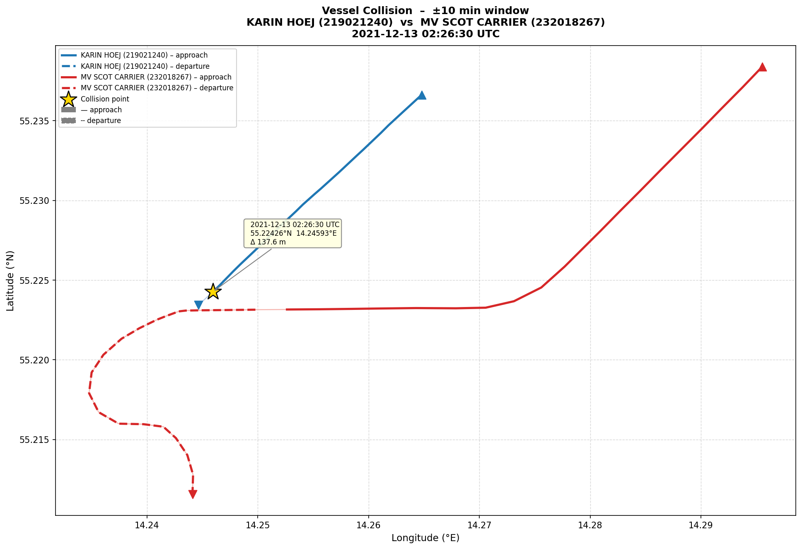

# Big Data Exam — AIS Vessel Collision Detection

This project detects a collision event between two vessels in from December 1, 2021 to December 31, 2021 from Danish AIS data. The dataset is isolated to contain ships within a 50 nautical mile radius of:

- Latitude: 55.225000  
- Longitude: 14.245000  

The pipeline is implemented using PySpark and fully containerized with Docker.

---

## Goal

To locate two vessels that either collided or experienced the close physical proximity, indicating a collision, and then:

- Calculate the collision timestamp and location
- Determine trajectories ±10 minutes around collision
- Graph both vessel path

---

## Repository Structure

├── src/
│ ├── main.py # Spark pipeline entry point
│ ├── preprocessing.py # Cleaning, filtering, anomaly removal
│ ├── collision.py # Collision detection logic
│ └── visualization.py # Trajectory plotting
│
├── data/
│ └── raw/extracted/ # AIS CSV files (Dec 2021)
│
├── output/ # Generated results (created from Docker container)
│ ├── results.txt
│ └── collision_trajectory.png
│
├── Dockerfile
├── docker-compose.yml
├── entrypoint.sh
├── requirements.txt
└── README.md

## Data Setup

AIS data is downloaded from:
http://aisdata.ais.dk/

All December 2021 CSV files are downloaded into data/raw/extracted/. It looks like:

aisdk-2021-12-01.csv
aisdk-2021-12-02.csv
...
aisdk-2021-12-31.csv

## Build the Docker Image

```bash
docker build -t ais-collision:latest .
```

## Run the Pipeline

### Full Dataset: 

```bash
docker compose run --rm ais-collision \
spark-submit \
  --master local[*] \
  --driver-memory 8g \
  --conf spark.sql.shuffle.partitions=200 \
  /app/src/main.py \
  "/app/data/raw/extracted/*.csv"
```

### Single-Day Test (Example Day for Collision Date) 
```bash
docker compose run --rm ais-collision \
spark-submit \
  --master local[*] \
  --driver-memory 4g \
  --conf spark.sql.shuffle.partitions=50 \
  /app/src/main.py \
  "/app/data/raw/extracted/aisdk-2021-12-13.csv"
```

## Output
Results are written to the output folder:

output/results.txt

This contains: 
- MMSI of both vessels
- Vessel names
- Collision timestamp
- Collision coordinates
- Distance at closest approach

output/collision_trajectory.png shows both vessels' trajectories 10 minutes before and after the collision. 

## Methodology 
1. AIS CSV files were loaded using Spark, and the columns were normalized with snake_case. 
2. Filtering & Anomaly Removal
- Filtering of dirty MMSIs was done
- Vessels were restricted to just Class A vehicles
- Only vessels “under way” (engine or sailing) are included
- Speed filter: reatins moving vessels only (1 ≤ SOG ≤ 40 knots)
- Tug/pilot/rescue-related vessels are excluded
- Bounding box pre-filter: this ensures that only vessels in haversine-based 50 nautical mile radius filter determined by the project requirements are viewed for analysis 
- Removes teleportation anomalies using a speed threshold (> 60 knots)
- Since pings occur every few seconds, it was decided to create 30-second time buckets for these 

4. Collision Detection Strategy

To avoid O(n²) complexity:
- Spacial grid bucketing using 0.02° grid cells
- Time bucketing (30 seconds) 
- Local neighborhood joins (3x3 grid expansion)

For each candidate pair: 
- Distance is calculated using the haversine formula;
- The closest point of approach (CPA) is calculated
- Heading differences are used to see different movement patterns 
- Local minima are used to find sudden behaviors

Ranking pairs is done by scoring: 
- Minimum distance
- CPA consistency
- Trajectory shape (V-pattern detection)
- Length and time of interaction

## Visualization

Done using Matplotlib. Vessel trajectories are plotted in geographic coordinates. Collisions are marked with a star marker. A solid line represents the approach phase and a dashed line signifies the departure from the collision. 

## Results

The collision results are as follows: 

Vessel A  : KARIN HOEJ
MMSI A    : 219021240
Vessel B  : MV SCOT CARRIER
MMSI B    : 232018267
Timestamp : 2021-12-13 02:26:30 UTC
Latitude  : 55.224260
Longitude : 14.245933
Distance  : 137.6 m
CPA hits  : 2 ping-pairs
Time span : 39 s


This is marked by the gold star on the image, which marks the closest point between the vessels. Before this collision, KARIN HOEJ was moving in a relatively straight path. MV SCOT CARRIER changed direction, which led them to interfere with the path of the other ship and cause the collision.

